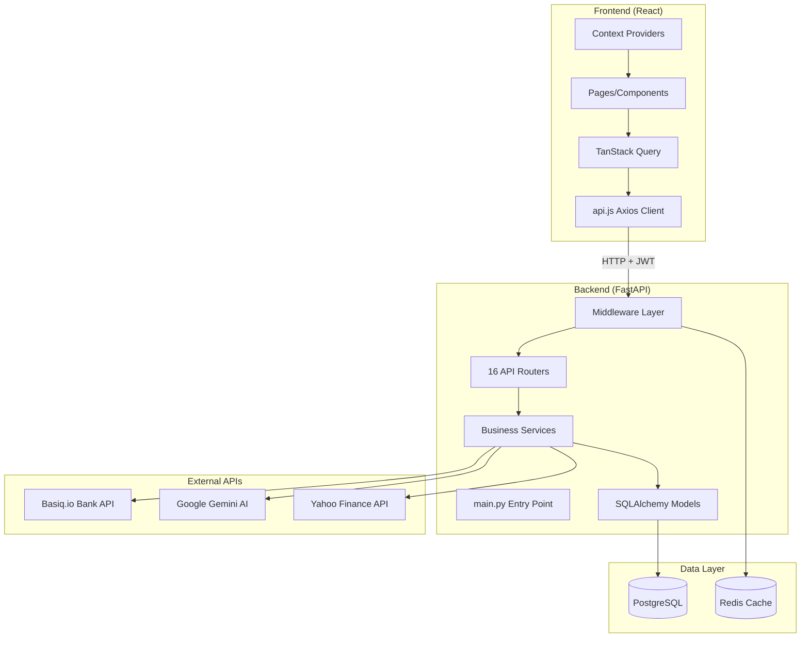
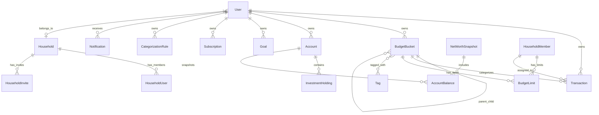

# Principal Finance - System Architecture Map

> **Long-Term Context Memory** for AI-assisted development. Last updated: January 2026.
> 
> 🗺️ **[Feature Roadmap](ROADMAP.md)** available.

---

## 🤖 Agent Onboarding (READ FIRST)

> **Before making any changes**, review these critical patterns and files.

### Critical Files to Check

| File | Why It Matters |
|------|----------------|
| `backend/auto_migrate.py` | **Auto-migrations run on startup**. Add new columns here for automatic deployment. |
| `backend/main.py` | Entry point. Calls `auto_migrate.run_migrations()` on startup. |
| `backend/database.py` | DB connection. Uses `DATABASE_URL` env var (PostgreSQL in prod, SQLite in dev). |
| `backend/models.py` | SQLAlchemy models. Schema changes here need corresponding migration. |
| `backend/schemas.py` | Pydantic schemas. Must match models for API serialization. |
| `.env` | Environment variables (gitignored). Contains `DATABASE_URL`, `SECRET_KEY`, etc. |

### Deployment Pattern

- **VPS**: Binary Lane (not Render)
- **Database**: PostgreSQL on production, SQLite locally
- **Deploy workflow**: `git pull` → restart backend → auto-migrations run automatically
- **No manual Python commands needed** on VPS for standard migrations

### Schema Change Checklist

When adding a new column to any model:
1. ✅ Add to `backend/models.py`
2. ✅ Add to `backend/schemas.py` (if exposed via API)
3. ✅ Add to `backend/auto_migrate.py` (for automatic deployment)
4. ✅ Commit and push to GitHub
5. ✅ On VPS: `git pull` and restart backend

### Common Pitfalls

- ⚠️ **Don't commit `.db` files** - They're gitignored but may be tracked from old commits
- ⚠️ **SQLite vs PostgreSQL** - Local dev uses SQLite, production uses PostgreSQL
- ⚠️ **Auto-migrate only handles ADD COLUMN** - Complex migrations need manual scripts

---

## High-Level Summary

**Principal Finance** is a comprehensive personal finance management application built for Australian users. It enables transaction tracking, budget management, net worth monitoring, investment portfolio tracking, and AI-powered financial insights. The platform supports multi-user household sharing with role-based access control, bank integration via Basiq.io, and a rich dashboard with customizable widgets.

---

## Tech Stack Overview

| Layer | Technology | Purpose |
|-------|------------|---------|
| **Backend** | FastAPI (Python 3.10+) | REST API framework |
| **Frontend** | React 19 + Vite | SPA with modern React |
| **Database** | PostgreSQL + SQLite (dev) | Primary data store |
| **Cache** | Redis | Session/response caching |
| **ORM** | SQLAlchemy 2.0 | Database abstraction |
| **State Management** | TanStack Query v5 | Server-state caching |
| **Routing** | react-router-dom v7 | Client-side navigation |
| **Styling** | Tailwind CSS v4 | Utility-first CSS |
| **Auth** | JWT + Refresh Tokens | Stateless authentication |
| **Deployment** | Docker + Binary Lane VPS | Containerized hosting |
| **Error Monitoring** | Sentry | Production error tracking |

---

## Key Directories

| Directory | Responsibility |
|-----------|----------------|
| `backend/` | FastAPI application - API server, models, services |
| `backend/routers/` | API route handlers organized by domain (16 routers) |
| `backend/services/` | Business logic, AI services, third-party integrations |
| `backend/migrations/` | Database schema migrations |
| `backend/models.py` | SQLAlchemy ORM models (27+ entities) |
| `backend/schemas.py` | Pydantic request/response schemas |
| `frontend/` | React application - UI components and pages |
| `frontend/src/pages/` | Page-level components (26 pages) |
| `frontend/src/components/` | Reusable UI components (62 components in 5 subdirs) |
| `frontend/src/components/widgets/` | Dashboard widget components (14 widgets) |
| `frontend/src/components/settings/` | Settings tab components (10 components) |
| `frontend/src/context/` | React context providers (Auth, Theme, Toast, Notification) |
| `frontend/src/services/` | API client (Axios wrapper) |
| `frontend/src/hooks/` | Custom React hooks (2 hooks) |
| `scripts/` | Utility scripts for migrations, testing, deployment |
| `tests/` | Backend test suite (pytest, 23 test files) |
| `.github/` | CI/CD workflows |
| `docs/` | Project documentation |

---

## Data Flow Diagram



---

## API Router Reference

| Router File | Prefix | Domain |
|-------------|--------|--------|
| `auth.py` | `/auth` | Authentication, MFA, password reset, session management |
| `settings.py` | `/settings` | User settings, buckets, rules, members, notification prefs |
| `transactions.py` | `/transactions` | CRUD operations, splitting, bulk actions |
| `analytics.py` | `/analytics` | Dashboard data, trends, forecasting, AI chat |
| `net_worth.py` | `/net-worth` | Accounts, snapshots, balances, holdings |
| `investments.py` | `/investments` | Portfolio tracking, history |
| `goals.py` | `/goals` | Savings goals tracking |
| `rules.py` | `/rules` | Transaction categorization rules (aliases to settings) |
| `ingestion.py` | `/ingestion` | CSV/PDF import, bank sync |
| `connections.py` | `/connections` | Basiq bank connections |
| `notifications.py` | `/notifications` | User notifications, bill reminders |
| `market.py` | `/market` | Stock ticker search, quotes |
| `taxes.py` | `/taxes` | Tax estimation (AU-specific) |
| `export.py` | `/export` | Data export (CSV/JSON) |
| `api_keys.py` | `/api-keys` | Personal API key management |
| `household.py` | `/household` | Family sharing, invites, permissions |

---

## Core Data Models



**Key Entities:**
- `User` - Authentication, settings, household association
- `Transaction` - Income/expense records with categorization
- `BudgetBucket` - Hierarchical categories with limits
- `Account` - Bank/investment/liability accounts
- `InvestmentHolding` - Stock/ETF positions within accounts
- `Subscription` - Recurring expense tracking
- `CategorizationRule` - Auto-categorization rules with priority ordering
- `Household` - Multi-user family sharing container
- `HouseholdMember` - Spending profiles for budget allocation

---

## Recent Changes & Fixes
- **Demo Account:**
  - Added `seed_demo_user.py` script for seeding demo data.
  - "Try Demo" button on login page (`demo@principal.finance` / `demo123`).
  - Generates 12+ months of realistic transactions, categories, accounts, investments.
- **Bug Fixes:**
  - Fixed Budget Categories page showing flat list on initial load (React Query cache key conflict).
- **Transactions:**
  - Added "Create & Add Another" button (Frontend).
  - Added "Manual Transaction" entry modal.
  - Fixed Inline Date Edit bug (Backend Schema update).
  - Widened Transaction table to 95% viewport width.
- **Subscriptions:**
  - **Shared Subscriptions:** Added `parent_id` (Self-referential FK) to link reimbursements to expenses.
  - Added "Net Cost" calculation for grouped subscriptions.
  - Fixed 500 Error (Missing column migration).
- **Dashboard Budget Fixes:**
  - Standardized month difference calculation.
  - **Sankey Diagram:** Added "Deficit" node logic to balance diagram when Expenses > Income (visual fix).
  - **Budget Cards:** Fixed Subcategory categorization. "Wants" subcategories (e.g. Dining Out) now separated from "Needs" parents (e.g. Food).
- **Data Integrity:**
  - Added vote `created_at` timestamp to User model.
  - Added `bucket_id` linking for `Subscription` model.
  - **Split Transactions:**
    - Refined UI: Positive inputs only, auto-balance for 2 splits.
    - Fixed logic: Logic now modifies parent transaction (Split 1) + creates new sibling (Split 2).
    - Fixed Budget Refunds: Removed validation filter to allow positive "refund" transactions in budget analysis.

---

## Crucial Files (High Complexity)

> ⚠️ **Extra caution required** when editing these files.

| File | Lines | Complexity Reason |
|------|-------|-------------------|
| `backend/routers/analytics.py` | ~2,100 | Largest router. Complex aggregation queries for dashboard, trends, forecasting, anomaly detection, AI chat integration. |
| `frontend/src/pages/DataManagement.jsx` | ~1,300 | Multi-tab import/export, CSV parsing, PDF upload, Basiq integration, confirmation dialogs. |
| `frontend/src/pages/Transactions.jsx` | ~1,200 | Complex table with filtering, sorting, bulk selection, inline editing, category dropdowns, and keyboard shortcuts. |
| `frontend/src/pages/NetWorth.jsx` | ~950 | Account cards, investment holdings, balance snapshots, chart visualization, inline editing. |
| `backend/routers/ingestion.py` | ~800 | Multi-format parsing (CSV/PDF), bank sync, transaction deduplication, validation. |
| `frontend/src/components/RulesSection.jsx` | ~900 | Drag-drop rule ordering, preview matching, complex form state, multi-condition rules. |
| `backend/routers/auth.py` | ~1,100 | MFA flow, password reset, email verification, session management, Google OAuth. |
| `frontend/src/pages/Subscriptions.jsx` | ~750 | Recurring detection, manual entries, bucket mapping, calendar visualization. |
| `backend/models.py` | ~441 | All 27+ SQLAlchemy models. Central schema definition. |
| `backend/schemas.py` | ~450 | All Pydantic validation schemas. Breaking changes affect API contracts. |

---

## State Management Pattern

1. **Server State** - TanStack Query (`@tanstack/react-query`)
   - Caches API responses with `staleTime: 5min` and `cacheTime: 10min`
   - Query invalidation on mutations
   - Optimistic updates for responsiveness

2. **Auth State** - `AuthContext.jsx`
   - JWT tokens in localStorage
   - Auto-refresh via Axios interceptor in `api.js`

3. **UI State** - React Context
   - `ThemeContext` - Light/dark mode
   - `ToastContext` - Toast notifications
   - `NotificationContext` - Bell notifications

4. **Local Component State** - `useState`, `useReducer`

---

## External Dependencies

| Service | Purpose | Config Location |
|---------|---------|-----------------|
| **Basiq.io** | Australian open banking API | `BASIQ_API_KEY` env var, `services/basiq.py` |
| **Google Gemini** | AI categorization & chat | `GEMINI_API_KEY` env var, `services/ai_*.py` |
| **Yahoo Finance** | Stock prices via `yfinance` | `routers/market.py`, `services/` |
| **Sentry** | Error monitoring | `SENTRY_DSN` env var |
| **Redis** | Caching (optional) | `REDIS_URL` env var |
| **SMTP** | Email (password reset, invites) | SMTP env vars |

---

## Environment Variables

| Variable | Required | Purpose |
|----------|----------|---------|
| `DATABASE_URL` | Yes | PostgreSQL connection string |
| `SECRET_KEY` | Yes | JWT signing key |
| `ENVIRONMENT` | No | `development` / `production` |
| `CORS_ORIGINS` | No | Allowed frontend origins |
| `GEMINI_API_KEY` | No | AI features |
| `BASIQ_API_KEY` | No | Bank integration |
| `SENTRY_DSN` | No | Error monitoring |
| `REDIS_URL` | No | Caching |

---

## Development Commands

```bash
# Backend
cd backend
pip install -r requirements.txt
uvicorn main:app --reload --port 8000

# Frontend
cd frontend
npm install
npm run dev  # Vite dev server on :5173

# Testing
pytest                    # Backend tests
npm run test             # Frontend tests (vitest)
npm run test:coverage    # With coverage

# Docker (full stack)
docker-compose up

# Seed Demo Data (VPS deployment)
docker cp /opt/principal/scripts/seed_demo_user.py $(docker compose ps -q backend):/app/seed_demo_user.py
docker compose exec backend python /app/seed_demo_user.py
```

---

## Routing Structure (Frontend)

| Path | Page Component | Description |
|------|----------------|-------------|
| `/` | `Dashboard.jsx` | Main dashboard with widgets |
| `/transactions` | `Transactions.jsx` | Transaction list & management |
| `/budget` | `Budget.jsx` | Budget categories & limits |
| `/net-worth` | `NetWorth.jsx` | Accounts & snapshots |
| `/investments` | `Investments.jsx` | Portfolio tracker |
| `/goals` | `Goals.jsx` | Savings goals |
| `/reports` | `Reports.jsx` | Spending reports & trends |
| `/settings` | `Settings.jsx` | User & app settings |
| `/subscriptions` | `Subscriptions.jsx` | Recurring expenses |
| `/calendar` | `FinancialCalendar.jsx` | Transaction calendar view |
| `/insights` | `Insights.jsx` | AI-powered insights |
| `/review` | `Review.jsx` | Transactions needing review |
| `/login` | `Login.jsx` | Authentication |
| `/register` | `Register.jsx` | User registration |

---

## Testing Strategy

- **Backend**: pytest with 68+ tests covering auth, API endpoints, services
- **Frontend**: Vitest + React Testing Library
- **CI**: GitHub Actions (`.github/workflows/`)

---

## Notable Patterns

1. **Hierarchical Categories** - `BudgetBucket` supports parent/child relationships for nested budgets
2. **Rule Priority** - `CategorizationRule.priority` determines execution order (lower = higher priority)
3. **Household Sharing** - All data scoped to `household_id` for multi-user access
4. **Drag-Drop** - Uses `@dnd-kit` for widget reordering and rule prioritization
5. **Toast Notifications** - Custom `ToastContext` replaces browser alerts
6. **Command Palette** - `Cmd/Ctrl+K` for quick navigation
7. **Demo Account** - `demo@principal.finance` / `demo123` with realistic sample data

---

*Generated for AI context. Do not commit to version control.*
